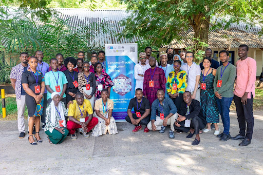
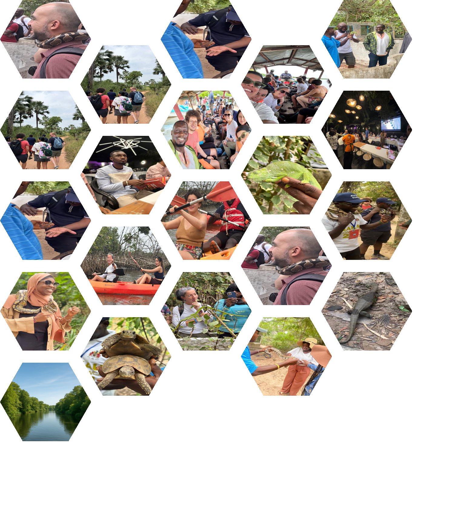

# Introduction

Powered by Data.org, the Epiverse-TRACE project has made substantial
progress toward producing analytics tools aimed at addressing the most
critical questions during epidemics. Currently, up to [fourteen (14)
Epiverse-TRACE
packages](https://epiverse-trace.github.io/etstats/index.html) are
available on [CRAN](https://cran.r-project.org/) This reflects the
results of two years of joint efforts between team members and our user
communities.

Every year, the Epiverse-TRACE team members, along with invited
stakeholders from WHO, Data.org, and various healthcare organizations,
convene to discuss progress, evaluate deliverables, and plan future
activities. The third Epiverse-TRACE annual summit will be held at the
MRC Unit in Fajara, The Gambia from December 2 to 6, 2024, under the
theme: **Strengthening Sustainable and Inclusive Analytics Ecosystem for
Epidemic Preparedness**.

[Data.org](https://data.org)

## Pre Summit Training

Prior to commencing the summit, we have conducted a week-long pre-summit training 
course on "Outbreak Analytics and Applied Modelling with R" at MRCG, Banjul, The Gambia.
The training program was designed to provide participants with practical skills in outbreak
data analysis using specialized R packages. This training was facilitated by Epiverse-TRACE
members from MRCG, LSHTM, and TRACE-LAC. The full report about this course is available on 
zenodo: [Pre-summit Training report](https://zenodo.org/records/14946723).

## Opening Ceremony

The third Epiverse Summit was held in Banjul from the 2nd to the 6th of December 
under the theme “Strengthening a Sustainable and Inclusive Analytics Ecosystem for
Epidemic Preparedness”. This annual flagship event brought together 44 participants,
including 6 members of the LSHTM, 4 members from Universidad Javeriana and Universidad 
de los Andes in Colombia, 6 members from the MRC Unit The Gambia, and 5 members of 
data.org. The discussions during the welcome ceremony at the Sir Dawda Kairaba Jawara 
International Conference Centre were centered around the importance of the Epiverse 
initiative and plans for its second phase.

...the development of analytics tools for pandemic preparedness and response is timely and essential ..

This is a global initiative and it is about building open-source tools for analysis to transform the way we deliver data science for social good. Our main goal was to change how analytics tools are used in global infectious disease response, moving from ad-hoc approaches to integrated, generalisable and scalable community-driven software

## Sustainability of Epidemics Analytics Tools

## Inclusivity within Epiverse-TRACE Tools

Khairoonisa Foflonker's presentation at the EPIVERSE Summit effectively
demystified inclusivity by highlighting its fundamental principles, the
crucial role of cultural sensitivity and power dynamics, and the need to
move beyond operational EDI towards strategic and transformational
approaches that address systemic barriers and foster a true sense of
belonging within research and work environments. The presentation
encourages critical self-reflection and proactive steps towards building
more inclusive cultures.

## Team Building 

### Summary
The thrill of the Kartong Snake Farm to the rhythm of paddles on the River Gambia, our team-building journey blended adventure, culture, and collaboration. This report highlights how these experiences strengthened team members' trust, communication, and camaraderie.

### Objectives 
Build resilience through shared challenges.
Strengthen team connections and foster collaboration.
Encourage trust and effective communication.

### Actives
Conference Dinner: An Evening of Connection
The conference dinner set the tone for the summit, with teams sharing stories over traditional dishes like Benachin. Informal conversations sparked ideas that carried into the days ahead.
Kartong Snake Farm Visit: Facing Fears & Building Trust
At the Kartong Snake Farm, teams confronted fears and embraced curiosity. Handling snakes like pythons became a metaphor for tackling workplace challenges head-on.
Boat Ride & Tanji Bird Reserve: A Journey of Discovery
Where the river meets the ocean, our boat ride to the river-ocean confluence symbolised unity in diversity. At the Tanji Bird Reserve, teams observed over 45 bird species, drawing parallels between ecological harmony and workplace collaboration.
Kayaking: Paddling in Sync
The summit culminated with a 15km kayaking challenge on the River Gambia. Coordinating strokes and maintaining communication mirrored the teamwork required under workplace pressure.

### Outcome
Increased Collaboration: Strengthened interpersonal relationships and teamwork.
Enhanced Trust: Facing challenges together improved confidence and trust among team members.
Improved Communication: Effective coordination during activities reinforced the importance of clear communication in the workplace.

### Closing
This journey was just the beginning. Let’s keep exploring, learning, and growing together. The lessons gained from this experience will continue to inspire teamwork and collaboration in our workplace.

## One Health

## Disease Surveillance

## Designing Outbreak Analytics Course

Training is a cornerstone of the Epiverse-TRACE project, ensuring that our advanced analytics packages are recognized and adopted by a broader community. As the project enters its second phase, the focus shifts towards developing and delivering structured courses. Training within Epiverse-TRACE is facilitated through a variety of resources, including showcases, case-studies, how-to guides,  tutorials, and the Epi Training Kit [EpiTkit](https://epiverse-trace.github.io/epi-training-kit/index-EN.html).
During the final day of the summit, participants shared insights on designing an in-person data-centered outbreak analytics course aimed at training and teaching outbreak analysis as well as on the translation and adaptation of the Epi Training Kit materials for  African context. The discussion also reflected on lessons learned from previous training sessions, identified existing gaps, and explored strategies to address them.
In this session, the training team presented the pre-summit training report along with its feedback see [Pre-summit Training report](https://zenodo.org/records/14946723) 

We also discussed strategies for implementing training in the project's second phase, including the EpiTkit modules as part of comprehensive training in TRACE-LAC for Latin America and the LSHTM-MRCG plans for delivering training courses in Africa. 
The discussion centered on four key aspects of training: content, audience, cultural adaptation, and assessment. Participants, divided into five groups, responded to targeted questions within each aspect. Their insights were collected and summarized in the following boxes.

### Contents

The course should be designed as an integrated, flexible, and adaptable
training program, allowing for self-paced learning while remaining easy
to follow. Focus on merging and re-emerging infectious diseases,
vector-borne diseases, and non-communicable health challenges. Key
examples include Ebola, Mpox, HIV, Malaria, Chikungunya, Dengue, Marburg
virus disease, and cervical cancer caused by HPV.

### Audience

 Encourage ongoing, inclusive feedback by offering multiple channels--such as in-person 
 or virtual input, anonymous surveys, real-time comments, and discussion forums--while 
 also engaging focus groups, diverse participants, and local leaders to ensure all perspectives, 
 especially underrepresented ones, are heard and addressed
 
 ### Cultural Adaptation
 
Customize course materials for each training session by respecting regional, cultural, 
and religious differences; promote inclusivity through culturally aware content, inclusive language,
and a clear code of conduct that fosters respect and avoids reinforcing bias or discrimination. 

### Assessment

Conduct ongoing evaluations through surveys, interactive games, and practical exercises 
to assess learning and engagement; foster sustained stakeholder involvement via platforms
like GitHub and group discussions to gather both structured and qualitative feedback for continuous improvement.
 

**MRCG:** 

1. Bubacarr Bah

2. Nuredin Mohammed 

3. Abdoelnaser Degoot

4. Bankole Ahadzie

5. Karim Mané

6. Atta Lowe

7. Kebba Secka

**LSHTM** 

1. Adolfo Valle Campos 

2. Adam Kucharski 

3. Carmen Tamayo 

4. James Azam

5. Joshua Lambert

6. Sebastian Funk

**Pontificia Universidad Javeriana** 

1. Andrés Moreno Barbosa

2. Laura Gomez-Bermeo

3. Zulma M. Cucunubá

**Universidad de los Andes** 

1. Maria Camila Tavera Cifuentes 

2. Natalia Nino

**Data.org** 

1. Chris Hartgerink 

2. Diana Fajardo Pulido

3. Maguette Ndong

4. Paul Korir 

5. Uyi Steward

**WHO** 

1. Finlay Campbell

